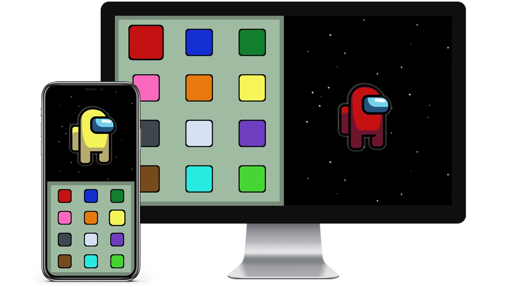

# Among Us Crewmate

## Projeto feito para praticar HTML, CSS e Vue.js

Um dos projetos que mais gostei de fazer, com toda a certeza. Aprendi alguns detalhes de CSS que nunca precisei utilizar antes, e finalmente entendi como os pseudo elementos ```:before``` e ```:after``` são úteis.

O desenho do tripulante foi feito seguindo a Speed Art disponível [aqui](https://youtu.be/JDI0zz2Waqw). Aproveitei e acrescentei a seleção de cor do tripulante para me desafiar.

## Preview


___

### Project setup
```
yarn install
```

#### Compiles and hot-reloads for development
```
yarn serve
```

#### Compiles and minifies for production
```
yarn build
```

#### Lints and fixes files
```
yarn lint
```

